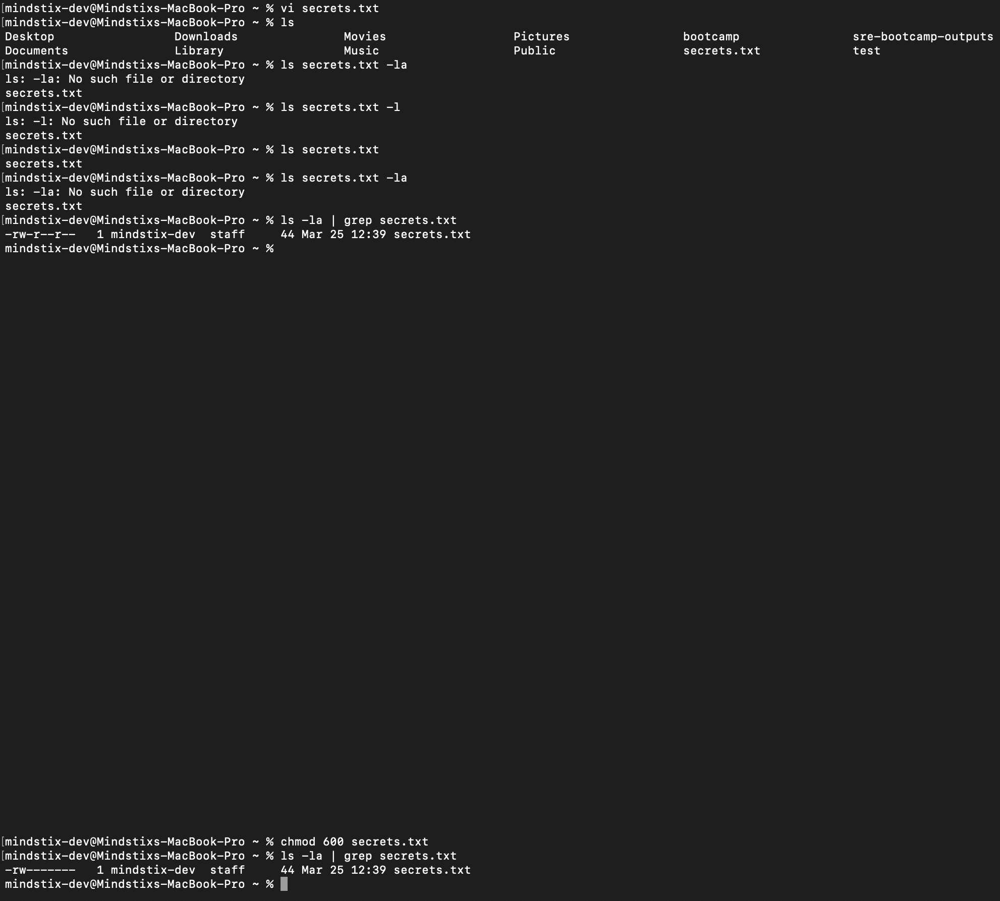
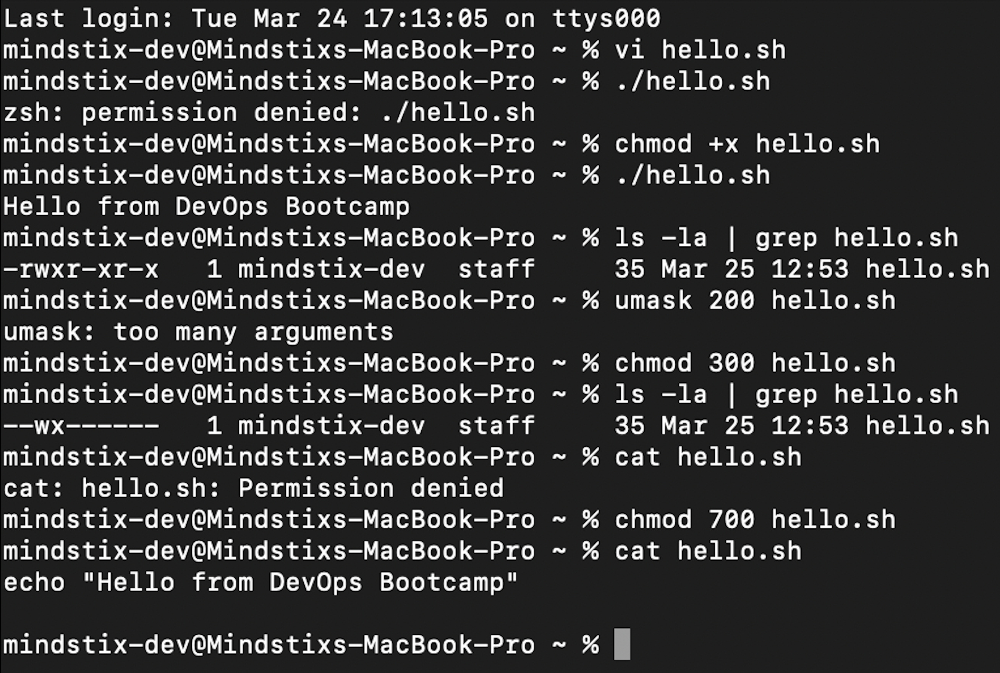

Assignment 1B — Permissions Debugging
Create a file called secret.txt in your home directory with some text in it.
Set permissions so that ONLY you can read and write it. No one else can even read it.
Create a shell script hello.sh that prints "Hello from DevOps Bootcamp". Try running it with ./hello.sh. It will fail. Figure out why and fix it without using bash hello.sh.
Now intentionally break it: remove your own read permission from hello.sh. Try running it. What error do you get? Why? Restore it.
Create a directory shared/. Set permissions so anyone can enter the directory and read files, but only you can write to it. What numeric chmod value achieves this?

1st and 2nd --> 
3rd and 4th --> 